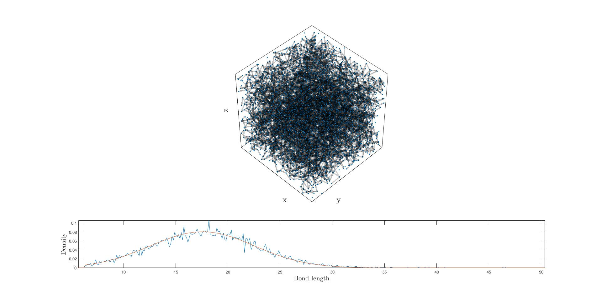
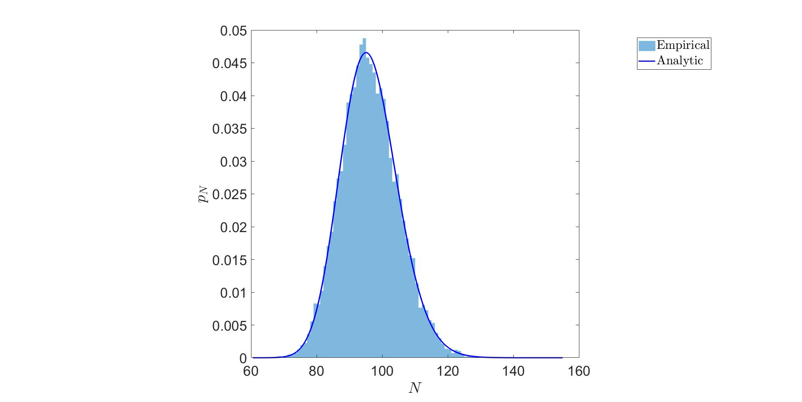
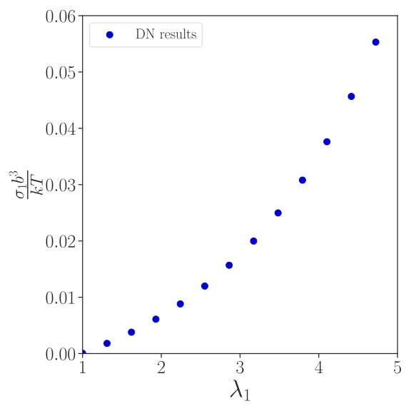
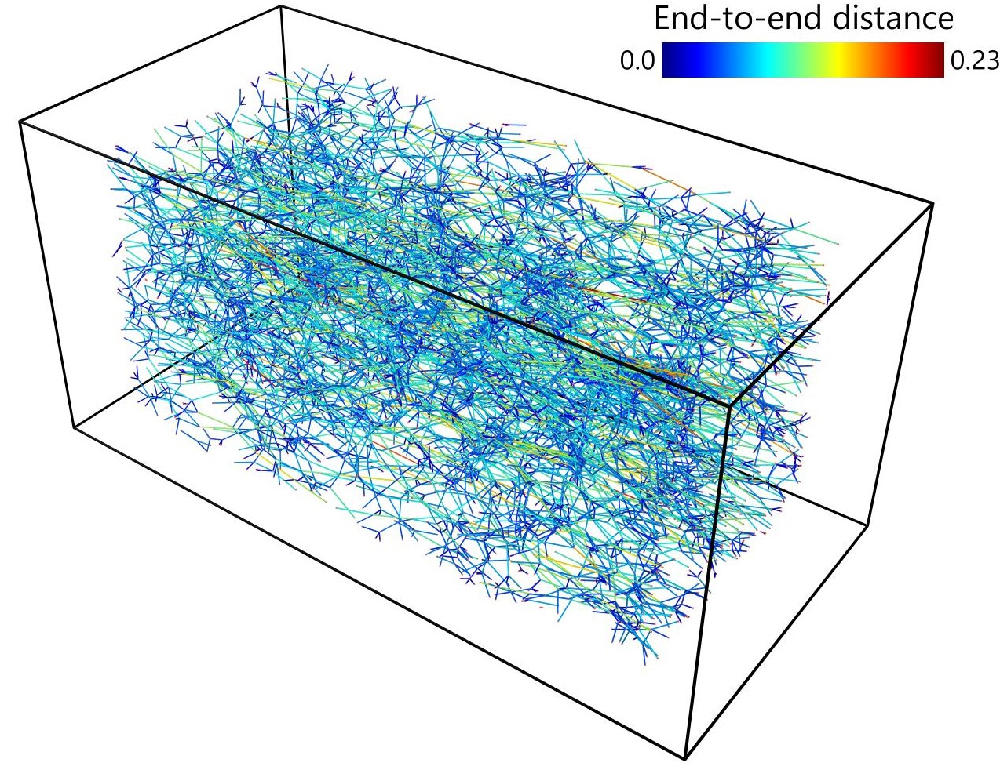
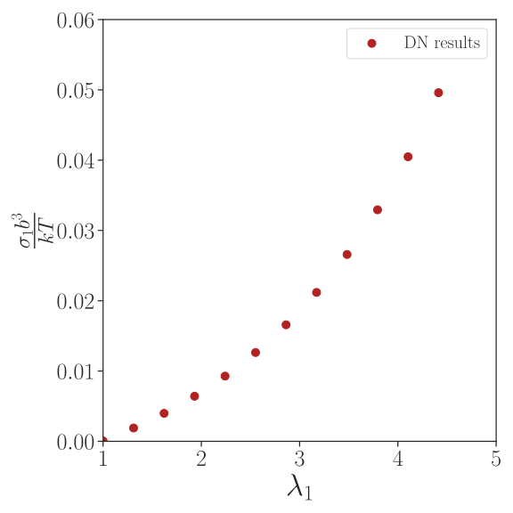

# Discrete_Nets

## Table of contents
- [Description](#Description)
- [Citing](#Citing)
- [Folders](#Folders)
  - [Simulation](#Simulation)
  - [Network generation](#Network-generation)
  - [Chain behaviours](#Chain-behaviours)
- [LAMMPS](#LAMMPS)
  - [What is LAMMPS and why use it?](#what-is-LAMMPS-and-why-use-it)
  - [Windows users](#Windows-users)
  - [Compiling LAMMPS](#Compiling-LAMMPS)
    - [Pre-requisites](#Pre-requisites)
    - [Downloading LAMMPS](#Downloading-LAMMPS)
    - [Building LAMMPS](#Building-LAMMPS)
    - [Inclusion of bond (chain) behaviours](#Inclusion-of-bond-chain-behaviours)
    - [Troubleshooting](#Troubleshooting)
  - [Supported chain behaviours](#Supported-chain-behaviours)
    - [Gaussian](#Gaussian)
    - [Freely-jointed chain](#Freely-jointed-chain)
    - [Breakable extensible FJC](#Breakable-extensible-FJC)
    - [Breakable FJC](#Breakable-FJC)
- [DN visualisation](#DN-visualisation)
- [Example](#Example)
  - [DN generation](#DN-generation)
  - [Input file](#Input-file)
  - [Launching the simulation](#Launching-the-simulation)
  - [Visualising the results](#Visualising-the-results)
  - [Polydispersed results](#Polydispersed-results)
- [Contributing](#Contributing)
- [Issues and support](#Issues-and-support)
  
## Description
`Discrete_Nets` is a repository containing codes in Python, MATLAB, and C++ to run Discrete Network (DN) simulations to model the mechanical response of rubbery networks, such as elastomers and hydrogels.
The primary features include:

* **Topology control**: Generate random networks with independent control of the chain end-to-end distance and chain density, by allowing the interpenetration of chains.
* **LAMMPS**: Find mechanical equilibrium of the network via energy minimisation carried out in LAMMPS.
* **Custom chain behaviours**: Straightforwardly incorporate customised single chain behaviours

## Citing 
Please cite the following works if this project was useful for your work:
```
@article{MangasAraujo2024DN,
    Title = {Micromechanical modelling of rubbery networks: the role of chain pre-stretch},
    Author = {Mangas Araujo, Lucas, Kryven, Ivan, and Brassart, Laurence},
    Journal = {International Journal of Non-Linear Mechanics},
    Volume = {},
    Pages = {},
    Year = {2024}}
```

```
@article{Kryven2022,
   title={Sequential construction of spatial networks with arbitrary degree sequence and edge length distribution},
   author={Kryven, Ivan and Versendaal, Rik},
   journal={arXiv preprint arXiv:2207.08527},
   year={2022}
}
```

The first paper can be found here, whereas the second can be accessed at [Kryven and Rik Versendaal](https://arxiv.org/abs/2207.08527)

## Folders
### Simulation
`Simulation` contains three Python scripts (`run.py`, `utils.py`, and `plotCurves.py`) and a text file (`inputs.txt`) 

* `run.py:` control code of the simulation, calling LAMMPS and outputting simulation results.
* `util.py:` script containing secondary functions called by `run.py`.
* `plotCurves.py:` script for plotting stress-stretch curve
* `input.txt:` text file containing the user-defined information (see usage in [Example](#Example))
  
### Network generation
`Network generation` contains a set of MATLAB codes to generate random networks with independent control of the chain end-to-end distance and chain density, by allowing the interpenetration of chains.

* `main.m:` control code of the algorithm, in which the user defines the network parameters.
* `createGraph.m:` function that receives user inputs, generates the network, and displays the results of the generation process.
* `GeometricGraph.m:` function that assembles the network.
* `networkInformation.m:` function that returns information of the as-generated networks for later usage.
* `createBoundaryNodes.m` function that creates additional boundary nodes.
* `findBoundaryNodes.m:` function that locates the location of the boundary nodes.
* `writeTxtFile.m:` function that writes the text file used in the Discrete Network simulation.
* `polydispersity` function that returns an array of chain lengths drawn from a prescribed distribution. The current version only supports the log-normal distribution.

### Chain behaviours
`Chain behaviours` contains a set of subroutines in C++ that are used in LAMMPS to model the interaction between the junction (nodes) points. See more details in [Inclusion of bond (chain) behaviours](#Inclusion-of-bond-chain-behaviours).


## LAMMPS
### What is LAMMPS and why use it?
In brief, LAMMPS (Large-scale Atomic/Molecular Massively Parallel Simulator) is an open-source code written in C++ for molecular dynamics problems. Its documentation can be found [here](https://docs.lammps.org/Manual.html). We leverage the efficient energy minimisation algorithms available in LAMMPS, such as FIRE, to find the position of the inner junctions in the DN for a given macroscopic deformation gradient. In LAMMPS, the junctions and chains are treated as atoms and bonds, respectively. 


### Windows users
LAMMPS was primarily developed to be run on Unix-based machines. While recent versions of LAMMPS can run on Windows machines, the following installation and compilation steps only apply to Unix machines. Therefore, Windows users are advised to use Windows Subsystem for Linux (WSL), which allows users to run Linux without a separate virtual machine or dual booting. For instructions on setting up Linux on Windows, refer to this [link](https://docs.lammps.org/Howto_wsl.html) in the LAMMPS documentation.

### Compiling LAMMPS 
Using LAMMPS within this project requires compiling it from the source with specific packages that are not included in basic installations. Follow these steps to install and compile LAMMPS for running DN simulations correctly:

#### Pre-requisites
In the terminal, run the following commands to upgrade and install the required packages
```bash
  sudo apt update
  sudo apt upgrade -y
  sudo apt istall cmake build-essential ccache gfortran openmpi-bin libopenmpidev
  libfftw3-dev libjpeg-dev libpng-dev python3-dev python3-pip python3-
  virtualenv libblas-dev liblapack-dev libhdf5-serial-dev hdf5-tools
```
Check if the `g++` compiler is installed by running:
```bash
  dpkg --list | grep compiler
```
If `g++` does not show up in the list, install it running:
```bash
  sudo apt-get update
  sudo apt-get install g++
```

Finally, make sure that the following Python packages are installed:
* `numpy`
* `matplotlib`
* `pandas`
* `seaborn`


#### Downloading LAMMPS
Download the stable version of LAMMPS from GitHub using the following command in the terminal
```bash
  mkdir lammps
  git clone -b stable https://github.com/lammps/lammps.git lammps
```
Next, navigate to `src/MOLECULE/` and add all the C++ files contained in the `Chain behaviours` folder.

#### Building LAMMPS
To build LAMMPS, run first the following commands in the terminal 
```bash
  cd lammps/lammps
  mkdir build
  cd build
  cmake ../cmake
```
These commands prepare for the building process.

Next, ensure that the  `MOLECULE` package is activated, as it is needed to run the simulation. Run the following command in the terminal to launch a TUI (text user interface) showing all packages available:
```bash
  ccmake ../cmake/
```
In the TUI, navigate to find the `MOLECULE` package and activate it. Ensure that the changes are configured properly before exiting the TUI.  

To initiate the compilation using multiple cores, execute:
```bash
  make -j N
```
where `-N` is the number of cores to be used. 

After this step, a library `liblammps.a` and LAMMPS executable `lmp` inside the `build` folder. To conclude the compiling process, install LAMMPS by running:
```bash
  make install  
```


#### Inclusion of bond (chain) behaviours
Chain behaviours in LAMMPS are implemented as bond behaviours, defining interactions between two atoms. To add new chain behaviours, users must include C++ subroutines in the `src/MOLECULE/` folder, providing both a header (`.h`) and a source file (`.cpp`). LAMMPS offers various predefined bond behaviours that can be utilized as references when implementing specific chain behaviours. After adding a new bond behaviour, it is necessary to recompile LAMMPS. This can be done by navigating to the `build` folder and running the following commands:

```bash
  make -j N
  make install  
```

#### Troubleshooting 
If issues arise when following the previous steps, the [LAMMPS documentation](https://docs.lammps.org/Manual.html) and [this YouTube video](https://www.youtube.com/watch?v=Id3eVPDinDE&t=204s) can be referred to for further assistance.

## Supported chain behaviours
### Gaussian
Gaussian chains are modelled through the `harmonic` bond type in LAMMPS. The free energy $w$ of a harmonic bond as a function of the separation $r$ of its ends is:
```math
  w = \kappa(r - r_0)^2,
```
where $\kappa$ and $r_0$ respectively represent the bond stiffness and the rest length. For Gaussian chains, $\kappa = \frac{3kT}{2Nb^2}$, and $r_0 = 0$, with $kT$ denoting the temperature in energy units, and $N$ and $b$ respectively representing the number of Kuhn segments and Kuhn length.

### Freely-jointed chain
The Freely-jointed chain (FJC) behaviour is the simplest model to account for the finite extensibility of polymer chains. The free energy $w$ as a function of the separation $r$ of the chain ends is given by: 
```math
      w  = N kT\left[ \frac{r \beta}{N b} + \log \left(\frac{\beta}{\sinh \beta}\right)\right] \quad \textnormal{with} \quad \beta = \mathcal L^{-1}\left(\frac{r}{Nb} \right),
```

where $\mathcal{L}(x)=\coth{x}-1/x$ is the Langevin function.

## Breakable extensible FJC
The extensible freely-jointed chain behaviour ([Mao et al.](https://www.sciencedirect.com/science/article/pii/S2352431616302681)) allows the stretching of the Kuhn lengths $b$, regularising the free energy of the FJC for large chain elongations. Let $\lambda_b$ define the segment stretch, the free energy is given by:
```math
w  = \varepsilon(\lambda_b) + N kT\left[ \frac{r \beta}{\lambda_bNb_0} + \log \left(\frac{\beta}{\sinh \beta}\right)\right] \quad \textnormal{with} \quad \beta = \mathcal L^{-1}\left(\frac{r}{\lambda_b Nb_0} \right),
```
where $b_0$ is the initial Kuhn length. $\varepsilon(\lambda_b) = \frac{1}{2}E_b(\lambda_b - 1)^2$  represents the enthalpic part of $w$, with $E_b$ characterizing the segments stiffness. $\lambda_b$ is such that it minimises $w$ under a fixed $r$. The semi-analytical solution for $\lambda_b$ proposed by [Li and Bouklas](https://www.sciencedirect.com/science/article/pii/S0020768319303804) is used for efficiency. The bond is broken whenever $\varepsilon$ reaches a critical value $\varepsilon_c$.

### Breakable FJC
The breakable FJC has the same energy form as a regular FJC, but the bond breaks when the chain reaches a critical stretch $\lambda_{cr}$.


## DN visualisation
Once the energy minimisation step in LAMMPS is completed, a `.dat` file is generated that can be visualised. Although many visualisation softwares are available, we recommend Ovito for visualising  the deformed networks. A free version of Ovito can be downloaded [here](https://www.ovito.org/#download).

## Example
This example shows how to simulate a uniaxial tension. This example assumes that the user has correctly compiled LAMMPS using the previous guidelines.

### DN generation
In MATLAB, open `main.m` and use the following inputs:
```matlab
  dim = 3;
  n = 10e3;
  expected_bond_length = 12;
  var_bond_length = 5;
  nu = 1e-3;
  compensation_factor = 1.35;
  file_name = "test.txt";
  folder_name = "Networks/"; 
  chain_length = 100;
  D = [0 0 0 0 1 0 ];
  polydisperse_flag = true;
  distribution = "Log";
  distribution_par = {chain_length, 30};
```
This generates two text files `test.txt` and `test_Log.txt` in the newly created folder `Networks`. The code will additionally generate figures similar to the following ones:





### Input file
The input file `inputs.txt` contains the information for the simulation, and it is structured as follows:
```text
    $Dimension
    3
    $Geometry
    ../Network generation/Networks/test.txt
    $As-generated chain density
    0.001
    $Spring: 1-Gaussian, 2-Langevin, 3-XLangevin, 4-FracLangevin
    2
    $Spring parameters
    1 100
    $Loading: 1-Uniaxial, 2-Biaxial, 3-Shear
    1
    $Final stretch and number of increments
    10 30
    $Results folder
    Results/
    $Should configurations be stored[y/n]
    y
```

**Remark: Chain parameters are always passed with units. However, as a preprocessing step, the code normalises parameters with dimensions, since LAMMPS works with dimensionless quantities.**

### Launching the simulation
Open the terminal and run the following command:
```bash
  python3 run.py
```
If permission errors arise, run the following instead:
```bash
  sudo python3 run.py
```
Once completed, `run.py` will have generated a folder named `Results` containing the text file `data_uniaxial.txt`. This file contains the stress and stretch of the simulation. In this example, the code will also have created the `Current_geometries` folder containing the current configuration of the network at each stretch increment. 

### Visualising the results
In your preferred Python editor, run `plotCurves.py`. A plot similar to the following one will show up:



The following image generated with Ovito illustrates how the deformed DN at increment 2 would look like:




### Polydispersed results
Replace `test.txt` with `test_Log.txt` in `inputs.txt` and run `run.py`. Once completed, run  `plotCurves.py` to plot the uniaxial response of the polydispersed DN. A curve similar to the one below should appear:




## Contributing
We are always open to collaborations and help. If you have any new ideas, suggestions, or applications, we would be happy to include them.

## Issues and Support
For support or questions, please email **Lucas** at [lucas.mangasaraujo@eng.ox.ac.uk](lucas.mangasaraujo@eng.ox.ac.uk)
